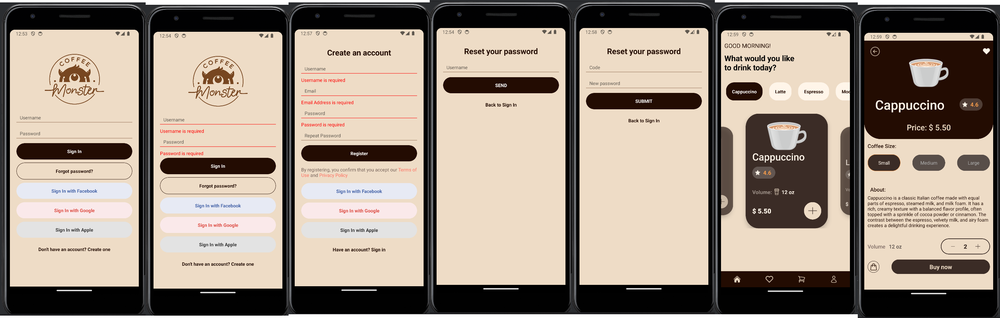
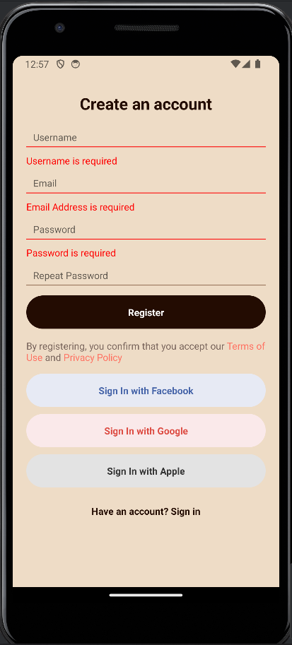
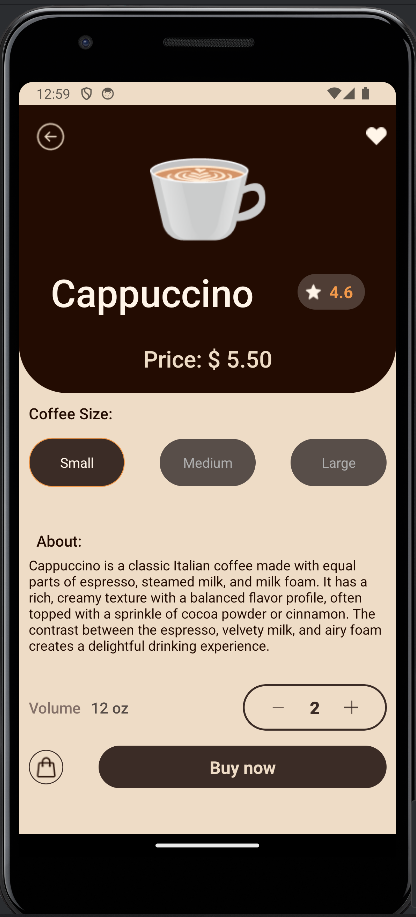

# COFFEE MINI APP



## Description

Welcome to the Coffee App! This mobile application is built using React Native and Expo, providing a delightful coffee ordering experience right from your smartphone. With a sleek user interface and intuitive navigation, this app is designed to make ordering your favorite coffee drinks a breeze.

## Key Features

*React Native Navigation*: Utilizing React Native Navigation for seamless navigation between screens.




*Carousel for Slides*: Incorporating a carousel component for showcasing featured coffee drinks and promotions.

*Authentication with Native Hook Form*: Implementing authentication rules with Native Hook Form for secure user login and registration.


*Data Display*: Utilizing data to dynamically display coffee items and details on the app's pages.



*React Native Bottom Tabs*: Integrating bottom tabs for easy access to different sections of the app's navigation.


## Getting Started

To begin development on Amplication, ensure that you have the following prerequisites installed:

-Node.js
-Git
-Expo CLI (for React Native)
-Android Studio (for Android development)

## Instructions
To get started with the project, follow these steps:

1. **Download**: Download: Download the code from the branch or clone the repository and install dependencies:

```shell
git clone https://github.com/ElenBlackwood/coffee-login-app.git && cd .coffee-login-app 
```
2. **Open**: Open the downloaded code in any code editor. 

3. **Terminal**: Open the terminal.

4. **Navigate**: Navigate to the main folder in the terminal.
   make sure you are in the right folder

```shell
cd .coffee-login-app
```
5. Open with Android Studio: Run the following command to open the project in Android Studio and launch the Android emulator:
```shell
npm run android
```

## License
Distributed under the MIT License. See LICENSE.txt for more information.
